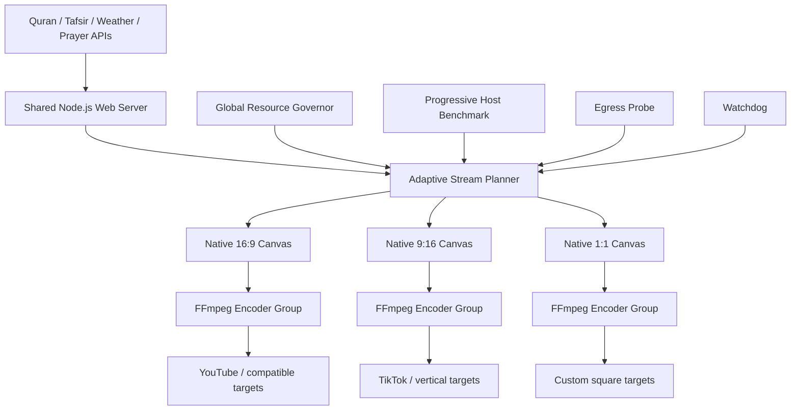

# Quran Live Stream

<p align="center">
  <strong>24/7 adaptive Quran broadcasting with native per-platform layouts, resource-aware quality, synchronized recitation, bilingual Tafsir, weather and global prayer times.</strong>
</p>

<p align="center">
  
  
  
  
  
  
</p>

<p align="center">
  
</p>

## Overview

QuranLiveStream is an autonomous live-broadcast engine for YouTube, TikTok, Facebook, Twitch, Kick and arbitrary RTMP/RTMPS destinations. It combines Quran recitation, Arabic text, translation, dual Tafsir, global weather, local clocks and prayer times in a continuously running broadcast.

The current architecture is built around three rules:

1. **Only selected platforms are published.** `STREAM_TARGETS` controls the exact destinations.
2. **Every aspect ratio is rendered natively.** Browser viewport, Xvfb canvas and encoded frame use the same final dimensions. The universal worker does not use FFmpeg `scale`, `crop` or `pad` to force one platform into another platform's shape.
3. **Quality is earned by measured capacity.** Benchmark + runtime governor select the highest sustainable profile and automatically reduce profile/FPS/UI cost under pressure.

## Native multi-platform layouts

The planner groups destinations by aspect ratio, codec and—on powerful hardware—platform quality ceiling.

| Layout | Typical destinations | Native examples |
| --- | --- | --- |
| Landscape 16:9 | YouTube, Facebook, Twitch, Kick, custom RTMP | 854×480, 1280×720, 1920×1080, 2560×1440, 3840×2160 |
| Portrait 9:16 | TikTok, Instagram/Reels, Shorts/vertical destinations | 480×854, 720×1280, 1080×1920, 1440×2560, 2160×3840 |
| Square 1:1 | Custom/social workflows | 480×480, 720×720, 1080×1080 and higher |

If YouTube and TikTok are selected together, they use separate native canvases because their aspect ratios differ. If several selected platforms are compatible, the engine shares one encoder and fans the encoded stream out through FFmpeg `tee` to save CPU/GPU.

Custom destinations can override their layout and capabilities:

```env
CUSTOM1_RTMP_TARGET=rtmps://example.com/live/private-key
CUSTOM1_LAYOUT=square
CUSTOM1_MAX_PROFILE=balanced
CUSTOM1_MAX_FPS=30
CUSTOM1_MAX_VIDEO_BITRATE=6000k
```

## Adaptive quality profiles

| Profile | Landscape native frame | Typical intent |
| --- | ---: | --- |
| `nano` | 640×360 | emergency/minimum-load mode |
| `micro` | 854×480 | ultra-low-resource VPS |
| `eco` | 1280×720 | efficient HD |
| `balanced` | 1920×1080 | Full HD |
| `high` | 2560×1440 | 1440p when verified sustainable |
| `ultra` | 3840×2160 | 4K when benchmark/hardware allows |
| `extreme` | 7680×4320 | custom 8K-capable workflows only when explicitly supported |

A manual `STREAM_PROFILE` is treated as a **ceiling**, not permission to overload the host. The progressive benchmark can approve higher tiers only after real encode tests. NVENC is used only after an actual smoke test succeeds; VAAPI remains opt-in where driver/X11 behavior is uncertain.

On a 1 vCPU / 1 GB server the system normally starts around `micro` and may fall to `nano` or reduce FPS further if necessary. Stronger hardware can rise to 1440p/4K after verification.

## Resource envelope

The resource governor watches:

- total host CPU usage;
- total memory pressure;
- the slowest active FFmpeg worker;
- benchmark ceiling;
- selected platform count and native layout groups;
- measured outbound bandwidth.

Defaults target comfortable headroom instead of running continuously at saturation:

```env
RESOURCE_CPU_SOFT=78
RESOURCE_CPU_HARD=88
RESOURCE_RAM_SOFT=82
RESOURCE_RAM_HARD=89
SYSTEMD_CPU_HARD_PCT=90
RESOURCE_SPEED_SOFT=0.97
```

The governor progressively reduces resolution, then FPS and UI cost. At the absolute minimum floor it stops restarting repeatedly and lets the systemd CPU/memory envelope contain overload instead of creating a restart loop.

## Architecture



## Quick start

```bash
git clone https://github.com/Alaa91H/QuranLiveStream.git
cd QuranLiveStream
cp .env.example .env
chmod 600 .env
chmod +x scripts/*.sh
nano .env
```

Choose only the platforms you want:

```env
STREAM_TARGETS=youtube,tiktok

YOUTUBE_RTMP_URL=rtmps://a.rtmps.youtube.com/live2
YOUTUBE_STREAM_KEY=YOUR_KEY

TIKTOK_RTMP_URL=YOUR_TIKTOK_INGEST
TIKTOK_STREAM_KEY=YOUR_KEY

STREAM_PROFILE=auto
QUALITY_POLICY=auto
```

Prepare a fresh server:

```bash
./scripts/first_boot.sh --force
./scripts/setup_cron.sh
./scripts/control.sh preflight
./scripts/control.sh plan
./scripts/control.sh start
```

Useful controls:

```bash
./scripts/control.sh start youtube
./scripts/control.sh start youtube,tiktok,facebook
./scripts/control.sh status
./scripts/control.sh targets
./scripts/control.sh plan
./scripts/control.sh logs stream
./scripts/control.sh logs governor
./scripts/control.sh stop
```

The old `stream_youtube.sh`, `stream_tiktok.sh` and `stream_dual.sh` commands remain only as compatibility wrappers around the universal engine.

## Self-healing and maintenance

- `resource_governor.sh`: fast CPU/RAM/realtime-speed adaptation.
- `watchdog.sh`: verifies the shared web server and **every active native canvas/encoder group** and performs a coordinated restart if one group dies.
- `maintenance.sh`: fast-forwards clean server checkouts, rotates logs/cache, performs a clean weekly benchmark only when stale, and does **not** force an unnecessary daily restart or kernel page-cache drop.
- `setup_cron.sh`: installs watchdog and low-frequency maintenance while the fast governor runs as a user systemd service.
- systemd uses CPU and memory accounting plus a final safety envelope.

## Quality assurance

```bash
npm test
# or
node scripts/qa.js
```

The QA suite verifies:

- all 195 countries and 114 Surahs / 6,236 Ayahs;
- native 16:9 / 9:16 / 1:1 layouts;
- universal planner/worker/governor architecture;
- absence of geometry-changing `scale/crop/pad` filters in the native worker;
- progressive 1440p/4K benchmark gates;
- local API fixtures including the longest Ayah stress case.

GitHub Actions also runs Bash and JavaScript syntax checks plus the native-stream architecture gate on every push to `main`.

## Security

Keep `.env` private. Stream keys must never be committed. `.env.example` contains placeholders only, and CI verifies that `.env` is not tracked.

## License

MIT — see [LICENSE](LICENSE).
